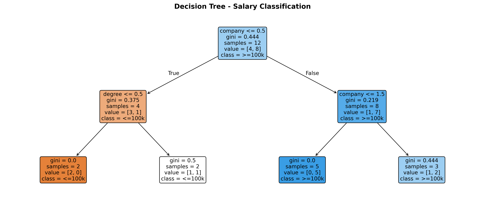
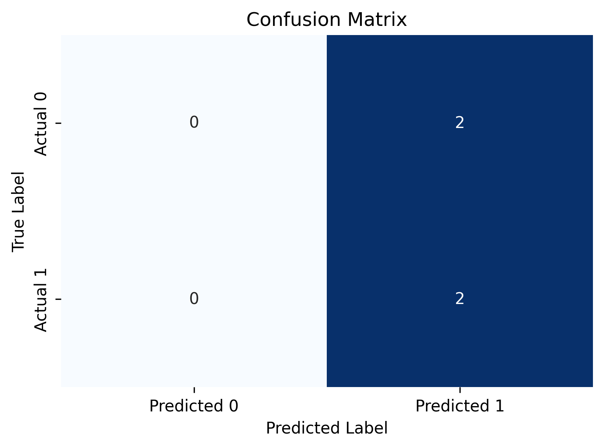

# Salary Classification Using Decision Tree 🌳
A beginner-friendly Decision Tree classifier that predicts whether a person earns **more than $100k** based on their company, job role, and degree.

---

## 📁 Project Structure
```
├── salary.ipynb               # Main notebook
├── salaries.csv               # Dataset
├── Confusion_matrix.png       # Confusion matrix output
├── Decision_tree_visualization.png  # Decision tree output
└── README.md
```

---

## 📊 Dataset
| Feature | Values |
|---|---|
| company | google, facebook, abc pharma |
| job | sales executive, business manager, computer programmer |
| degree | bachelors, masters |
| salary_more_then_100k | 0 (<=100k), 1 (>100k) |

- **Total rows:** 16
- **Class distribution:** 10 earn >100k, 6 earn <=100k

---

## ⚙️ What the Notebook Does

- Loads and explores the dataset
- Encodes categorical features using `LabelEncoder` (automatic)
- Trains a `DecisionTreeClassifier` with `max_depth=2` to prevent overfitting
- Evaluates using accuracy, precision, recall, and F1 score
- Uses **Leave-One-Out Cross Validation** for reliable accuracy on small data
- Visualises the confusion matrix, feature importance, and decision tree

---

## 🌳 Decision Tree Visualisation



### Reading the tree:
- **Root node:** splits on `company <= 0.5` (i.e. is it Google?)
- **Orange nodes** → predicts <=100k
- **Blue nodes** → predicts >100k
- **Gini = 0.0** → perfectly pure node (100% one class)
- **samples** → how many training rows reached that node
- **value = [x, y]** → x rows are <=100k, y rows are >100k

**Key insight:** Company is the most important feature — Facebook employees almost always earn >100k regardless of job or degree.

---

## 📉 Confusion Matrix



### Reading the matrix:
```
                Predicted 0    Predicted 1
Actual 0            0               2        ← 2 false positives
Actual 1            0               2        ← 2 true positives
```

The model predicted **everything as >100k (class 1)** — this is a classic symptom of a **very small dataset** (only 4 test samples). The model didn't get a chance to learn when to predict 0 properly.

---

## ⚠️ Limitations

- Dataset is only **16 rows** — accuracy numbers are not statistically reliable
- With only 4 test samples, one wrong prediction = 25% drop in accuracy
- Leave-One-Out CV gives a more honest estimate than a single train/test split

---

## 🛠️ Tech Stack
- Python 3
- pandas, numpy
- scikit-learn
- matplotlib, seaborn

---

## 🚀 What's Next
- [ ] Try with a larger dataset
- [ ] Compare Decision Tree vs Random Forest vs SVM
- [ ] Hyperparameter tuning with GridSearchCV
- [ ] Handle class imbalance with SMOTE

---

## 📚 What I Learned
- Decision Tree Classification
- Label Encoding (automatic vs manual)
- Train/Test Split and its limitations on small data
- Leave-One-Out Cross Validation
- Reading a Confusion Matrix and Decision Tree plot
- Metrics: Accuracy, Precision, Recall, F1 Score
